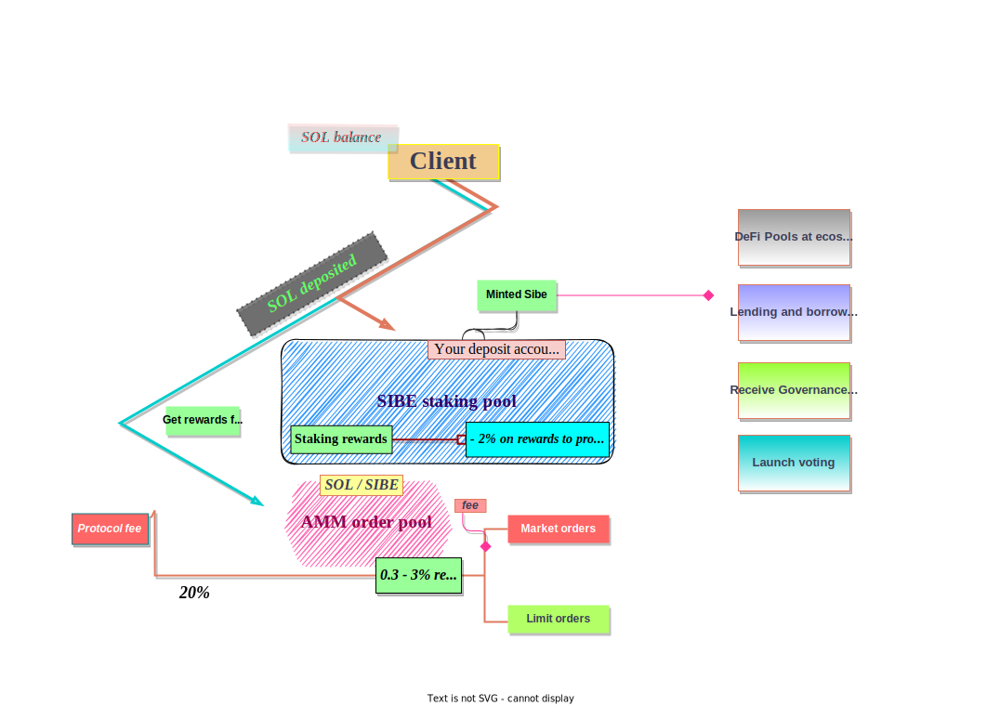

## Sibe token 

Sibe is a wrapped SOL spl token, which gives any person the ability to own the amount of spl token Sibe equivalent to the price. It’s price can be calculated with the next formula:
>**SIBE price = total staked / tokens minted**

 

## Staking pool 

Staking pool is a deposit back that exchanges stake [liquidity](../FAQ/Glossary#liquidity) amount of SOL for rewards to all owners by percent.

:::info

Sibe protocol has an ongoing management fee of (~0.14% p.a.) to support further product development. It is automatically taken from your staking rewards and equal to 2% of your rewards.

:::

#### Step by step

1. Stake your SOl and receive Sibe
2. Create your stake account and add liquidity equal to SOL
3. You can create 2 orders:

    **market order** — unstake your liquidity straightaway and pay the fee(0,3-3%)

    >market fee = max fee - (max fee - min fee) * amount after / target

    **limit order** — generate NFT order, that gives your stake rewards later

| |    |
| --- | ----------- |
| Deposit fee | 0%  |
| Limit order     | 0% |
| LMarket order   | 0,3 — 3% |
| Commission      | 2% on rewards (~0,14 on staked SOL)|

## AMM Order pool

The main characteristics of the Sibe protocol Sibe/SOL [liquidity pool](/FAQ/Glossary#liquidity-pool)  (as an internal  Sibe-SOL pool) are that it’s unbalanced on purpose and operates more efficiently when 100% liquidity is filled with SOL from liquidity providers.

There is a possibility to receive rewards from every market order accept for providing SOL liquidity pool.

### Order matching
Sibe protocol continuously regulates the liquidity pool to be 100% SOL, so all unnecessary operations are reduced and the liquidity pool reaches significant results on efficiency.
The process looks like this:

**A** 

As soon as the immediate unstake operation is complete, Sibe sent by the user unstaking and original SOL liquidity are included in the liquidity pool.

**B** 

The Sibe is provided from the liquidity pool just as the call of another stake operation happens.

**F**

To complete the adjustment and full liquidity for immediate unstaking, user deposited SOL at no cost are used to refill the liquidity pool.

### Pairs: SOL / SIBE

:::note

The pool has a linear swap fee decreasing until the target liquidity is reached to cover operation costs and incentivize liquidity providers. 75% of the fees go to liquidity providers and 25% to the SIBE treasury.

:::

Here are the 3 different situations that can happen when you use ‘Delayed unstake’ during epoch N.

* **You start unstaking during Z**, which is the very beginning of [epoch](/FAQ/Glossary#epoch) n (like a few minutes into epoch n).
You will receive your SOL at the beginning of epoch n+1. The amount of SOL you receive when the unstaking starts is computed as 
  >SOL = SIBE to burn * SIBE price 
  
 but SIBE price may not be updated as the SIBE protocol bot needs to be run to update the price at the beginning of each epoch. We suggest waiting a few hours into the epoch before using 'Delayed unstake' and starting it before the last 4 hours of the epoch.

* **You start unstaking during A.**
You will receive SOL at the beginning of epoch n+1. The amount computed when the unstaking starts is 
>SIBE to burn * SIBE price

* **You start unstaking during B**, which is the last 4 hours of epoch n.
You will receive SOL at the beginning of epoch n+2. The amount computed when the unstaking starts is 
>SIBE to burn * SIBE price

**Current parameters are:**

* max fee: 3%
* min fee: 0.3%
* liquidity target 100,000 SOL

## Sibeswap V1 
:::info

Coming soon

:::

## Sibe bot system

The bot takes care of multiple operations, mainly updating SIBE price, delegation strategy, and matching staking with unstaking orders.

## NFT

We will create a simple marketplace. At first, we are going to release only our collections, limit order snapshots and skins. Later there will be an ability to create and trade nft and also usage of nft along with DeFi will be integrated.

## Finance tokenomic plan

#### Example: 

1. Let's take a scenario where the parameters of the pool are close to the current situation:  

[Unstake liquidity](/FAQ/Glossary#unstake-liquidity): 581,250 SOL  
Amount you want to unstake immediately: 90 SOL  

Calculated:
>581,250 - 90 = 581,140 

Is 581,140 above 'liquidity target'?  
Yes, the fees are 0.3%. 

>90 SOL - 0.3% = 89.73 SOL

You receive 89.73 SOL after your transaction and you pay 0.27 SOL in fees for unstaking without delay. 

2. Now, let's take a (fictive) scenario where the parameters of the pool are very different:  

Unstake liquidity: 100,030 SOL  
The amount you want to unstake immediately: 9030 SOL  
Your fees would be calculated as such: 

>100,030 - 9030 = 91,000

Is 91,000 above 'liquidity target'? 
No. We calculate the fees with the following formula:

>market fee = max fee - (max fee - min fee) * amount after / target  
market fee = 3 - (3 - 0.3) * 91,000 / 100,000  
market fee = 3 - 2.457 = 0.543  
9030 - 0.543% = 8980.9671 SOL  

